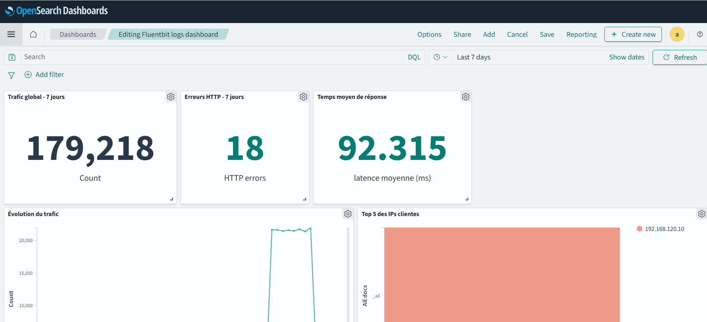
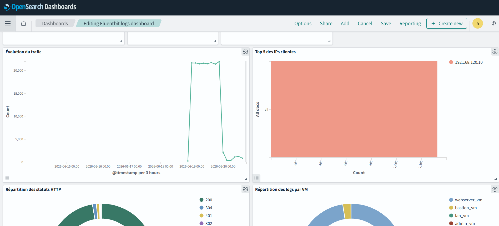
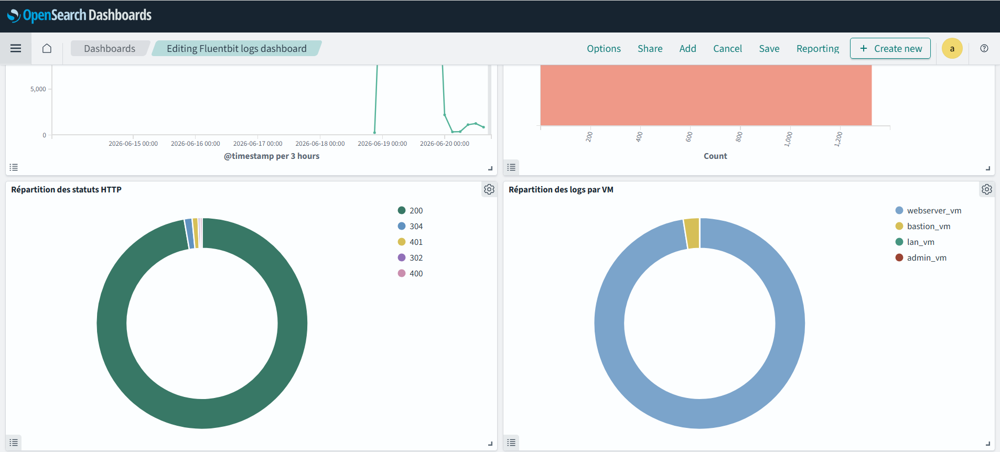
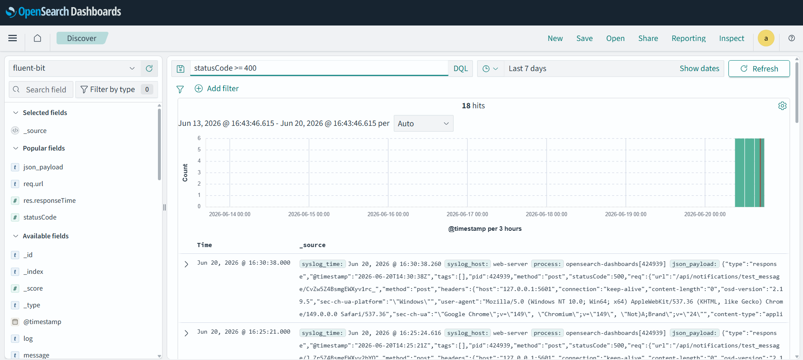
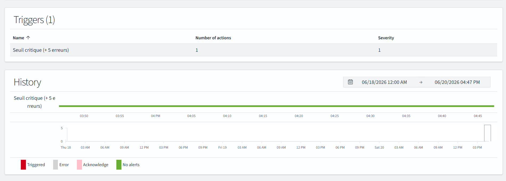
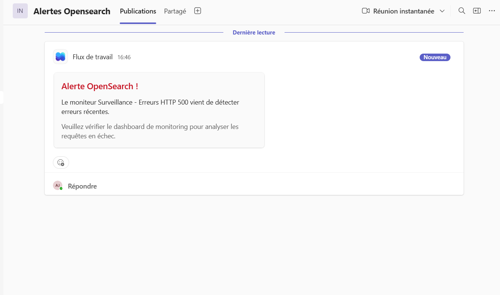

# Monitoring avancé avec Fluent Bit, OpenSearch et OpenSearch Dashboards

## 1. Objectif

Ce document présente la mise en place d’un système de monitoring avancé basé sur la collecte, le parsing, l’indexation, la visualisation et l’analyse des logs.

La solution mise en place permet de couvrir les éléments suivants :

* collecte centralisée des logs systèmes et applicatifs ;
* extraction et parsing des payloads JSON encapsulés ;
* enrichissement des logs avec des métadonnées géographiques et systèmes ;
* indexation des logs dans OpenSearch ;
* création de dashboards dans OpenSearch Dashboards ;
* configuration d’alertes sur les anomalies critiques ;
* analyse et investigation des incidents.

---

## 2. Stack technique utilisée

La stack de monitoring repose sur les composants suivants :

| Composant               | Rôle                                                        |
| ----------------------- | ----------------------------------------------------------- |
| Fluent Bit              | Collecte, parsing, enrichissement et transfert des logs     |
| OpenSearch              | Stockage, indexation et recherche dans les logs             |
| OpenSearch Dashboards   | Visualisation, dashboards, exploration des logs et alerting |
| Serveur Web / Backend   | Génération des logs                                         |

---

## 3. Architecture globale

L’architecture de monitoring est organisée autour d’une chaîne complète de traitement des logs.

```txt
Serveur (auth.log, syslog, etc.)
   ↓
Logs bruts (Texte + payload JSON)
   ↓
Fluent Bit (Filtre Regex + Decode JSON)
   ↓
Parsing + enrichissement
   ↓
OpenSearch
   ↓
OpenSearch Dashboards
   ↓
Dashboards / Alertes / Investigation
```

Le rôle de chaque étape est le suivant :

1. Le serveur ou l’application génère des logs.
2. Fluent Bit collecte les logs.
3. Fluent Bit parse les logs pour extraire les champs importants.
4. Fluent Bit enrichit les logs avec des métadonnées.
5. Les logs structurés sont envoyés vers OpenSearch.
6. OpenSearch indexe les logs.
7. OpenSearch Dashboards permet de visualiser les logs, créer des dashboards et configurer des alertes.

---

## 4. Collecte des logs avec Fluent Bit

Fluent Bit est utilisé comme agent de collecte de logs.

Il permet de :

* récupérer les logs générés par l’application ;
* lire les logs depuis des fichiers ;
* parser les logs structurés ;
* ajouter des informations complémentaires ;
* transférer les logs vers OpenSearch.

---

## 5. Parsing des logs

Les logs collectés contiennent souvent un en-tête système suivi d'un payload JSON. L’objectif du parsing est d'isoler ce JSON pour transformer le log brut en un document structuré avec des champs facilement filtrables.

### Exemple de parser Fluent Bit

```ini
[PARSER]
   Name         extract_syslog_json
   Format       regex
   Regex        ^(?<syslog_time>[^ ]+)\s+(?<syslog_host>[^ ]+)\s+(?<process>[^:]+):\s+(?<json_payload>\{.*\})$
   Decode_Field json json_payload
```

Ce parser permet à Fluent Bit de lire une ligne de log classique, d'isoler la partie json_payload, et de la décoder pour injecter les variables directement à la racine du document dans OpenSearch.

---

## 6. Champs exploités dans OpenSearch

Les logs envoyés dans OpenSearch contiennent plusieurs champs permettant l’analyse et la recherche.

| Champ               | Description                                         |
| ------------------- | --------------------------------------------------- |
| `@timestamp`        | Date et heure du log                                |
| `statusCode`        | Code de statut HTTP retourné (ex: 200, 404, 500)    |
| `req.url`           | Route API ou page web appelée                       |
| `method`            | Méthode HTTP utilisée (GET, POST...)                |
| `req.remoteAddress` | Adresse IP de l'utilisateur ou du client            |
| `req.userAgent`     | Navigateur et système d'exploitation bruts          |
| `res.responseTime`  | Temps de réponse du serveur en millisecondes        |
| `res.contentLength` | Taille de la réponse renvoyée en octets             |
| `source_host`       | VM source ayant généré le log                       |

Ces champs permettent de filtrer rapidement les logs dans OpenSearch Dashboards.

---

## 7. Indexation dans OpenSearch

Les logs collectés par Fluent Bit sont envoyés vers OpenSearch dans un index dédié (ex: fluent-bit-*).

L’indexation permet ensuite de rechercher, filtrer, agréger et visualiser les données géographiques et systèmes dans OpenSearch Dashboards.

---

## 8. Recherches utiles dans OpenSearch Dashboards

OpenSearch Dashboards permet d’explorer les logs à l’aide de requêtes.

### Rechercher les erreurs HTTP 500

```txt
statusCode: 500
```

### Rechercher toute les erreurs côté client et serveur

```txt
statusCode >= 400
```

### Rechercher les erreurs sur un endpoint précis

```txt
url: "/api/users" AND statusCode >= 400
```

### Rechercher les requêtes provenant d'une IP spécifique

```txt
clientip: "192.168.1.1"
```

### Rechercher les logs provenant d'une machine spécifique

```txt
_source_host: "webserver_vm"
```

Ces requêtes facilitent l’analyse des incidents et permettent de réduire le temps de diagnostic.

---

## 8.1 Champs réels du pipeline & détections de sécurité

> Référence faisant foi. Les exemples des sections précédentes décrivent un
> schéma applicatif générique ; voici les **champs réellement indexés** par le
> pipeline déployé (`roles/fluentbit`) et des **détections orientées sécurité**.

### Champs réellement disponibles (index `fluent-bit`)

**Logs système / sécurité** (`/var/log/auth.log`, `/var/log/syslog`, tag `system`) :

| Champ | Description |
| --- | --- |
| `@timestamp` | Date/heure |
| `source_host` | VM émettrice (`bastion_vm`, `webserver_vm`, `lan_vm`, `admin_vm`) |
| `process` | Démon émetteur (`sshd`, `sudo`, `fail2ban`…) |
| `message` | Message structuré (parser `syslog_plain`) |
| `log` | Ligne brute (toujours présente, fallback) |

**Logs d'accès Nginx** (`/var/log/nginx/access.log`, tag `nginx`, webserver_vm) :

| Champ | Description |
| --- | --- |
| `remote_addr` | IP cliente |
| `method` · `uri` | Méthode + route HTTP |
| `status` | Code HTTP (numérique) |
| `request_time` · `body_bytes` | Latence / taille réponse |
| `user_agent` · `referer` | Métadonnées client |

### Détections de sécurité (requêtes DQL — Discover)

| Objectif | Requête |
| --- | --- |
| **Brute-force SSH** | `process: sshd and message: "Failed password"` |
| Utilisateurs inexistants ciblés | `process: sshd and message: "Invalid user"` |
| Connexions SSH **réussies** (audit) | `process: sshd and message: "Accepted"` |
| Élévation de privilèges | `process: sudo` |
| **Bannissements fail2ban** | `process: fail2ban* and message: "Ban"` |
| Cibler une VM | `source_host: bastion_vm` |
| Erreurs/scan web | `status >= 400` |
| Scan de chemins (404 en masse) | `status: 404` puis agrégation sur `remote_addr` |

### Agrégations utiles (Visualize)
- **Top IP** sur `remote_addr` filtré `status >= 400` → scan/abus web.
- **Courbe `Failed password`** par `source_host` dans le temps → pic = attaque SSH.
- **Comptage `process: fail2ban*`** → efficacité du bannissement.

### Détection type : brute-force SSH
1. Discover : `process: sshd and message: "Failed password"`.
2. Agréger par `source_host` et par IP source (dans `message`).
3. Corréler avec `process: fail2ban* and message: "Ban"` → confirmer que l'IP a bien été bannie.
4. Si non bannie (IP dans l'allowlist) → décision : retirer de l'allowlist ou bloquer au pfSense.

### Limite connue (et piste d'amélioration)
Les logs **pfSense** (firewall/VPN) ne sont **pas encore centralisés** dans OpenSearch
(Fluent Bit tourne sur les VMs Linux, pas sur pfSense). Pour les inclure : configurer
le **Remote Syslog** de pfSense vers un input syslog Fluent Bit/OpenSearch. Documenté
comme évolution.

## 9. Dashboards

Des dashboards sont créés dans OpenSearch Dashboards afin d’avoir une vision claire de l’état du trafic et de la santé des services.

### Dashboard analytique

Le dashboard applicatif est construit autour d'une interface claire basée sur des cartes (card-based layout) et permet de suivre les indicateurs suivants :

* trafic global et temps de réponse moyen (res.responseTime) ;
* répartition des codes HTTP (statusCode) ;
* répartition des méthodes HTTP (method) ;
* top des endpoints les plus sollicités ou générant des erreurs (req.url) ;
* top des adresses IP clientes (req.remoteAddress).

### Exemples de visualisations

| Visualisation          | Objectif                                             |
| ---------------------- | ---------------------------------------------------- |
| Metric Card (Erreurs)  | Identifier rapidement une hausse d’erreurs 500/400   |
| Metric Card (Latence)  | Surveiller le temps de réponse moyen du serveur      |
| Histogramme HTTP       | Visualiser la santé globale et le volume du trafic   |
| Donut Chart (Méthodes) | Analyser la proportion de trafic en lecture/écriture |
| Bar Chart (Endpoints)  | Identifier les routes les plus visitées              |

### Captures d’écran du dashboard

```txt
docs/images/dashboard-overview.png
docs/images/dashboard-errors.png
docs/images/dashboard-http-status.png
docs/images/alert-rule.png
```

```md









```

---

## 10. Alerting

Des alertes sont configurées dans OpenSearch Dashboards afin de détecter automatiquement les anomalies.

L’objectif est d’être notifié lorsqu’un comportement anormal est détecté, par exemple une hausse importante des erreurs applicatives ou des erreurs HTTP 500.

### Alerte : erreurs HTTP 500

Condition surveillée :

```txt
statusCode: 500
```

Seuil d’alerte :

```txt
Nombre d’erreurs HTTP 500 > 5 sur 5 minutes
```

Niveau :

```txt
Critical
```

Objectif :

Identifier les erreurs serveur susceptibles d’impacter les utilisateurs.

---

### Alerte : endpoint instable ou scan de vulnérabilité

Condition surveillée :

```txt
statusCode >= 400
```

Seuil d’alerte :

```txt
Nombre d’erreurs > 50 sur 10 minutes (provenant de la même IP)
```

Niveau :

```txt
Warning
```

Objectif :

Identifier un endpoint en échec répété ou un comportement suspect d'une adresse IP.

---

## 11. Procédure d’investigation

En cas d’alerte, la procédure suivante peut être appliquée :

1. Ouvrir OpenSearch Dashboards.
2. Sélectionner la période correspondant à l’alerte.
3. Filtrer les logs avec le code HTTP concerné (statusCode).
4. Identifier la route (url) en erreur.
5. Isoler l'adresse IP cliente (clientip) pour retracer le parcours de l'utilisateur.
6. Identifier la cause probable de l’incident (ex: tentative d'accès non autorisé, erreur backend).
7. Corriger le problème côté infrastructure ou réseau.
8. Vérifier le retour à la normale dans le dashboard.
9. Documenter l’incident si nécessaire.

---

## 12. Exemple d’analyse d’incident

Exemple de scénario :

Une alerte est déclenchée car le nombre d’erreurs HTTP 500 dépasse le seuil configuré.

### Étapes d’analyse

Filtrage des erreurs HTTP 500 :

```txt
statusCode: 500
```

Identification des endpoints les plus touchés :

```txt
Agrégation sur le champ "url"
```

Filtrage sur l'IP cliente pour retracer l'action :

```txt
clientip: "203.0.113.42"
```

### Conclusion possible

L’analyse croisée de la route (url) et des tentatives de l'utilisateur (clientip) permet de confirmer si l'erreur 500 est due à un cas d'usage spécifique ou à une indisponibilité générale d'un service.

---

## 13. Organisation recommandée du repo

Une organisation possible des fichiers liés au monitoring est la suivante :

```txt
roles/fluentbit/
├── tasks/
│   └── main.yml
├── templates/
│   ├── fluent-bit.conf.j2
│   └── parsers.conf.j2
└── handlers/
    └── main.yml

docs/
├── monitoring-opensearch.md
└── images/
    ├── dashboard-overview.png
    ├── dashboard-errors.png
    ├── dashboard-http-status.png
    └── alert-rule.png
```

---

## 14. Résultat obtenu

La mise en place de cette chaîne de monitoring permet de disposer d’une solution complète pour la supervision applicative.

Elle couvre :

* la collecte automatisée des logs avec Fluent Bit ;
* le parsing des logs applicatifs ;
* l’extraction de métriques web clés (clientip, response, url) ;
* l’indexation des logs dans OpenSearch ;
* la visualisation des données dans OpenSearch Dashboards ;
* la création de dashboards de suivi ;
* la configuration d’alertes ;
* l’analyse rapide des incidents.

Cette solution améliore la capacité à détecter, comprendre et résoudre les anomalies applicatives.

---

## 15. Compétence validée

Cette mise en place permet de valider la compétence suivante :

> Advanced monitoring: dashboards, alerting, log parsing.

Les éléments concrets permettant de justifier cette compétence sont :

* configuration de Fluent Bit pour la collecte des logs ;
* définition d’un parser Regex personnalisé pour structurer les logs ;
* envoi des logs vers OpenSearch ;
* exploitation des logs dans OpenSearch Dashboards ;
* création de visualisations ;
* création de dashboards ;
* mise en place de règles d’alerte ;
* documentation d’une procédure d’investigation.
